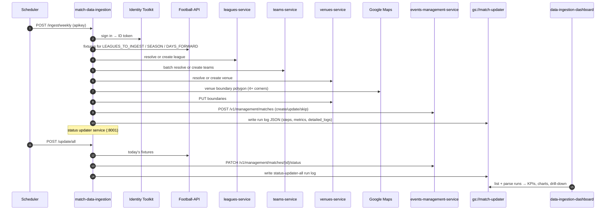
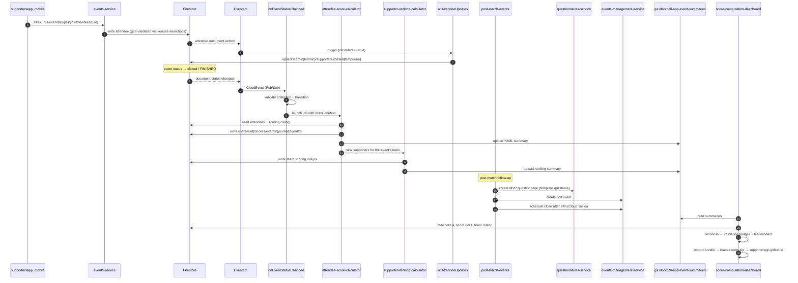

# ffan / SupportersApp — Application Catalogue

> Catalog of the 18 applications listed in [`ffan-supporter-application-list.md`](./ffan-supporter-application-list.md).
> Built from each project's `README.md` / architecture docs and configuration files (`application.properties`,
> `package.json`, `pubspec.yaml`, `.env`, deployment scripts). Code was inspected only where a relationship
> between applications was not documented.
>
> Generated: 2026-08-19

---

## 1. Executive summary

**SupportersApp (eFan)** is a cloud-native, event-driven **sports fan-engagement platform**. Supporters use a
Flutter mobile app to attend football matches (physically or remotely), sing team anthems, answer trivia and
polls, and earn scores that roll up into per-team supporter rankings published on a public site.

The platform is organized in six layers:

| # | Layer | Applications |
|---|-------|--------------|
| 1 | **Clients** | `supportersapp_mobile`, `supporterapp.github.io` |
| 2 | **Umbrella / contracts** | `supportersapp_backend` (mono-repo of submodules + OpenAPI specs + Firebase Functions) |
| 3 | **Domain microservices** | `events-service`, `events-management-service`, `teams-service`, `venues-service`, `leagues-service`, `songs-service`, `questionnaires-service`, `venues-searchpos` |
| 4 | **Ingestion & content generation** | `match-data-ingestion`, `query-injector` |
| 5 | **Scoring pipeline** | `score-computation` |
| 6 | **Observability, validation & QA tooling** | `data-ingestion-dashboard`, `score-computation-dashboard`, `event-match-tester`, `supportersapp_tools` |

### Cross-cutting platform conventions

| Concern | Convention |
|---|---|
| **Primary datastore** | Google Cloud **Firestore** (native mode) — events, users, teams, scores, attendees |
| **Spatial datastore** | **MongoDB Atlas** (`supporters` DB) for venue polygons + geospatial indexes; PostGIS referenced historically in `events-service` docs |
| **Object storage** | GCS buckets: `match-updater` (ingestion run logs), `football-app-event-summaries` (scoring summaries) |
| **Identity** | Firebase Auth (anonymous + password + google.com + github.com); service-to-service via Google Identity Toolkit ID tokens |
| **API auth** | `apikey` header (per-platform: iOS / Android) **plus** `Authorization: Bearer <Firebase ID token>` |
| **Hosting** | Cloud Run (services & jobs), Cloud Functions Gen2, Eventarc, Cloud Tasks, Firebase Hosting, GitHub Pages |
| **GCP project** | `phonic-altar-450817-q4` (project number `343004725643`) |
| **Regions** | `europe-southwest1` (Cloud Run), `europe-west1` (Functions), `eur3` (Eventarc/Firestore) |
| **Default port** | `8080` for every HTTP service |

---

## 2. Layer 1 — Clients

### 2.1 `supportersapp_mobile`

| | |
|---|---|
| **Type** | Mobile application (Android + iOS) |
| **Objective** | The supporter-facing app: register/authenticate, pick a favourite team, discover matches, check-in at a venue via geolocation, sing along to team songs, answer trivia queries and polls, and track personal progress/score. |
| **Stack** | Flutter / Dart · Firebase (Core, Auth, Firestore, Remote Config, Messaging/FCM, Analytics) · `provider` state management · `geolocator` + `permission_handler` (geofencing) · `just_audio` (song playback) · `dio` / `http` · `ntp` (server time sync) · `flutter_local_notifications` · `flutter_secure_storage` · i18n **ca / es / en** |
| **Architecture** | Layered: `core/` (constants, errors, l10n, logging, managers, services, state, theme, utils, widgets) → `data/` (models, repositories) → `presentation/` (pages, routes). Documented in `ARCHITECTURE.md` (Catalan). |
| **Depends on** | **`events-service`** — the only backend API it calls (`https://events-service-343004725643.europe-southwest1.run.app/v1`) · **Firestore** directly (reads events/scores, writes attendance data) · **Firebase Auth** · **Firebase Remote Config** (translation bundles `translations_ca/es/en`, versioned + cached locally) · **FCM** (push) |
| **Consumed by** | End users |
| **Repositories** | `match_repository`, `team_repository`, `song_repository`, `event_song_repository`, `event_song_attendance_repository`, `event_query_repository`, `user_repository` |
| **Release flow** | GitHub Release tag `vX.Y.Z` → CI builds `apk` + `ipa`, attaches to the release and uploads to **Firebase App Distribution** for the testing teams |

---

### 2.2 `supporterapp.github.io`

| | |
|---|---|
| **Type** | Public static website / blog |
| **Objective** | Public face of the product: multilingual blog, help pages (`attend_match`, `home_page`, `progress_page`), legal pages (legal notice, privacy policy, terms of use), and the **public daily team-score leaderboard**. |
| **Stack** | **Astro 6** · TailwindCSS 4 · MDX · `@astrojs/sitemap` + `@astrojs/rss` · `sharp` · TypeScript · Node ≥ 22.12 · hosted on GitHub Pages |
| **Content** | Content collections under `src/content/blog/{ca,en,es}`; routed pages per locale under `src/pages/{ca,en,es}` |
| **Depends on** | **`score-computation-dashboard`** — a custom Astro integration (`src/integrations/team-scores.ts`) unzips **`team-scores.zip`** into `src/data/team-scores/` at build/dev start and copies chart PNGs into `public/team-scores/`. The zip is produced by the dashboard's `npm run export-bundle`. If the zip is absent the integration writes stub data so the build still succeeds. |
| **Key component** | `src/components/TeamScores.astro` — renders the leaderboard from `scores.json` (rank, team, supporter count, avg/supporter, earned total, earned on team events, attendance rate, active supporters) |
| **Consumed by** | Public visitors |

---

## 3. Layer 2 — Umbrella repository

### 3.1 `supportersapp_backend`

| | |
|---|---|
| **Type** | Mono-repo / umbrella project (git submodules) + API contracts + Firebase Functions |
| **Objective** | Single entry point for the backend platform: aggregates every domain microservice as a **git submodule**, owns the **OpenAPI 3.0 contracts and data models**, the **Firebase Hosting / Firestore configuration**, and the **Firebase Functions** runtime. It is the canonical architectural documentation for the whole backend. |
| **Stack** | Git submodules · Firebase CLI (`firebase.json`, `.firebaserc`, `firestore.indexes.json`) · Node.js 20 Firebase Functions (region `europe-west1`) · OpenAPI 3.0 YAML · Postman collection · published on **StopLight** |
| **Submodules** | `events-service`, `events-management-service`, `teams-service`, `venues-service`, `leagues-service`, `songs-service`, `questionnaires-service`, `venues-searchpos`, `query-injector` — all from `github.com/SupporterApp/*` |
| **`/api`** | Specs: `Events.yaml`, `Teams.yaml`, `Venues.yaml`, `Songs.yaml`, `Questionnaire.yaml`, `Questions.yaml`, `Matches.yaml`, `Cast.yaml`, `SupporterEvents.yaml`, `Club.yaml`. Models: `EventBase`, `EventMatch(Details)`, `EventSong(Details)`, `EventCast(Details)`, `EventQuery(Details)`, `CastMessage`, `Team(Details)`, `League`, `Venue`, `Match(Details)`, `Song`, `Questionnaire`, `Question`, `QuestionUpload`, `Club`, `Country`, `Region`, `City`, `GeoPosition`, `Option`. |
| **`/functions`** | Node.js 20 Firebase Functions. Two families: **match-timing schedulers** — `checkFirstHalfStart`, `checkFirstHalfEnd`, `checkSecondHalfStart`, `checkFulltimeEnd`, `checkExtraTimeEnd`, `matchTrackerProcessor`, `eventSongProcessor`, `filterEvents`; and **mock/data generators** for testing — `generateMockEvents`, `generateMockMatches`, `generateMockTeams`, `generateMockSongs`, `generateMockCasts`, `generateMockQuestionnaires`, plus `generateCSRFToken`. |
| **Analysis docs** | `API_CALL_FREQUENCY_ANALYSIS.md`, `API_IMPLEMENTATION_GAP_ANALYSIS.md`, `FIXTURE_TIMING_VALIDATION_PROPOSAL.md`, `MATCH_TIMING_SWIMLANE.md` |
| **Published base URLs** | `https://api.supporters.io` → `/v1/events`, `/v1/teams`, `/v1/venues`, `/v1/questionnaires`, `/v1/questions` |

---

## 4. Layer 3 — Domain microservices

All Quarkus services share the same stack baseline: **Quarkus 3.19.1 · Kotlin 2.1.10 · Java 17+ · Maven ·
Firebase Admin SDK 9.2.0 (Firestore) · Jackson · JUnit 5 · Docker (JVM + native images) · port 8080**, and the
same env contract: `GOOGLE_APPLICATION_CREDENTIALS`, `GOOGLE_PROJECT_ID`, `SUPPORTERSAPP_IOS_APIKEY`,
`SUPPORTERSAPP_ANDROID_APIKEY`. Only the deltas are noted per service.

### 4.1 `events-service` — **the public read/participation API**

| | |
|---|---|
| **Objective** | The main customer-facing API. Serves events of every type to the mobile app and records supporter participation: attendance (with geolocation), song attendance, query/poll answers and per-user scores. It also re-exposes read-only views of teams, leagues, matches, venues, songs and questions so the mobile client only needs one host. |
| **Namespace** | `com.supplier.championleague` / project codename **champion-league** |
| **Extra stack** | Quarkus REST Client to **venues-searchpos**; historical PostgreSQL + **PostGIS** + Hibernate Spatial (Percona cluster) documented for spatial venue storage |
| **Endpoints** | `/v1/auth/{extract,validate}` · `/v1/users`, `/v1/users/{uid}`, `/v1/users/{uid}/scores`, `/v1/users/{uid}/scores/{eventId}` · `/v1/events` (+ `?type,name,date,status,lat,long`) · `/v1/events/{matches,songs,queries,polls}` and `/{id}`, `/{id}/details`, `/{id}/status`, `/{id}/summary`, `/{id}/events` · `/v1/events/{type}/{eventId}/attendees/{userId}` (+ `/details`, `/answers`) · `/v1/teams`, `/v1/leagues`, `/v1/matches`, `/v1/venues` (+ `/nearby`, `/inside`, `/positions`), `/v1/songs` · `/v1/questions` (+ `/upload`, `/bulkUpload`) · `/v1/{health,status,version}` |
| **Depends on** | Firestore · Firebase Auth · **`venues-searchpos`** (REST client, geofencing) |
| **Consumed by** | `supportersapp_mobile`, `event-match-tester`, `query-injector` (bulk question upload) |

### 4.2 `events-management-service` — **the back-office / write API**

| | |
|---|---|
| **Objective** | Administrative counterpart of `events-service`. Creates and maintains sports events — match events, song events, query events and polls — including status transitions and match summaries. This is the API that automated pipelines write to. |
| **Namespace** | `io.supporter.events` |
| **Extra stack** | Gson + Kotlinx Serialization alongside Jackson · Mockito + H2 for tests · **GraalVM native** build supported (`NATIVE_BUILD_COMPLETE.md`, `MIGRATION_*.md`) |
| **Endpoints** | `/v1/management/matches`, `/v1/management/songs`, `/v1/management/queries`, `/v1/management/polls` — each with `/`, `/{id}`, `/{id}/status`; matches also `/{id}/events`, `/{id}/summary`, `/{id}/summary/{state}` · `/v1/auth/extract` · `/v1/{health,status,version}` · `/sources/{sourceId}` |
| **Depends on** | Firestore · Firebase Auth · **`venues-searchpos`** (REST client) |
| **Consumed by** | **`match-data-ingestion`** (fixture creation + live status patching), **`score-computation/post-match-events`** (poll creation) |

### 4.3 `teams-service`

| | |
|---|---|
| **Objective** | Master data for football clubs: name, country, short name, crest, foundation year, location, nicknames, league affiliation. |
| **Endpoints** | `GET/POST /v1/teams` · `GET/PUT/DELETE /v1/teams/{id}` · `GET /v1/teams/{id}/details` |
| **Depends on** | Firestore only |
| **Consumed by** | `match-data-ingestion` (team resolution/creation), `event-match-tester` (team list), `score-computation/post-match-events`, `events-service` (read-through) |

### 4.4 `venues-service`

| | |
|---|---|
| **Objective** | Master data for stadiums/venues: name, address, city, country, capacity, club, founded, image, nickname, surface and — critically — the **boundary polygon** (`boundaries: [{lat,lng}…]`) used for geofencing supporter check-ins. |
| **Extra stack** | **MongoDB** (`quarkus.mongodb`, DB `supporters`, pool 5–20) in addition to Firestore — see `MONGODB_SETUP.md`; Quarkus REST Client to `venues-searchpos` |
| **Endpoints** | `GET/POST /v1/venues` · `GET/PUT/DELETE /v1/venues/{id}` |
| **Depends on** | Firestore · MongoDB Atlas · `venues-searchpos` |
| **Consumed by** | `match-data-ingestion` (venue resolution + boundary writes), `event-match-tester` (polygons), `events-service` |

### 4.5 `leagues-service`

| | |
|---|---|
| **Objective** | Competition master data: name, short name, founded, region (UEFA/EMEA…), season, `teamIds[]`, crest and lifecycle `state {status, startDate, endDate}`. |
| **Endpoints** | `GET/POST /v1/leagues` · `GET/PUT/DELETE /v1/leagues/{id}` |
| **Depends on** | Firestore only |
| **Consumed by** | `match-data-ingestion` (league resolution), `events-service` (read-through) |

### 4.6 `songs-service`

| | |
|---|---|
| **Objective** | Catalog of broadcast songs / club anthems: `name`, `duration`, `song_file` (media URL). Feeds the sing-along song events. |
| **Namespace** | `io.supporter.songs` |
| **Endpoints** | `GET/POST /songs` · `GET/PUT/PATCH/DELETE /songs/{id}` (PATCH updates duration only) |
| **Depends on** | Firestore only |
| **Consumed by** | `events-management-service` / `events-service` song events |

### 4.7 `questionnaires-service`

| | |
|---|---|
| **Objective** | Manages questionnaire templates (`TRIVIA`, `POLL`) and their question sets, including multi-option answers and per-creator ownership. Backs the interactive query events and post-match MVP polls. |
| **Namespace** | `io.supporter.questionnaires` |
| **Endpoints** | `GET/POST /v1/questionnaires` (+ `?createdBy`) · `GET/PUT/DELETE /v1/questionnaires/{id}` · `GET/POST /v1/questionnaires/{id}/questions` |
| **Depends on** | Firestore only |
| **Consumed by** | `events-service` (query event details), **`score-computation/post-match-events`** (creates MVP questionnaires from template questions `mvp-template-1001` / `mvp-template-1002`) |

### 4.8 `venues-searchpos`

| | |
|---|---|
| **Type** | Geospatial microservice (the only Go service in the platform) |
| **Objective** | High-performance point-in-polygon and proximity queries over stadium boundaries — answers *"which venues are near me?"* and *"am I inside this stadium?"*, which is the mechanism that validates a supporter's physical attendance. |
| **Stack** | **Go 1.16+** · **Gin** web framework · **MongoDB Atlas** with GeoJSON polygons + geospatial indexes · Docker / docker-compose · Cloud Run (`venues-searchpos-616245089133.europe-southwest1.run.app`) · secrets via Secret Manager (Mongo URI) |
| **Endpoints** | `GET /nearby?long&lat&maxDistance` · `GET /inside?long&lat` |
| **Depends on** | MongoDB Atlas only (no other internal service) |
| **Consumed by** | **`events-service`**, **`events-management-service`**, **`venues-service`** — all three wire it as `quarkus.rest-client.venue-searchpos-api.url` |
| **Extra docs** | `tecnical.md`, `vpc_and_nat.md` (VPC/NAT egress), IAM roles required for the CI service account |

---

## 5. Layer 4 — Ingestion & content generation

### 5.1 `match-data-ingestion`

| | |
|---|---|
| **Type** | Two Cloud Run services in one repo (ingestion + status updater) |
| **Objective** | Keeps the platform's football data in sync with the outside world. Fetches fixtures from **Football-API**, resolves/creates the matching leagues, teams and venues in the internal services, creates match events in `events-management-service`, enriches venues with **Google Maps geofencing polygons**, and continuously patches live match status/state. |
| **Stack** | **Python 3.11+** · **FastAPI** + Uvicorn · `uv` package manager · Firestore (idempotency mapping cache, prefix `ingestion_`) · Secret Manager · Docker · Cloud Run |
| **Endpoints** | Ingestion (`:8000`): `POST /ingest/weekly`, `POST /venues/update-boundaries`, `GET /health` · Status updater (`:8001`): `POST /update/status?league_id&season`, `POST /update/all` |
| **External APIs** | **Football-API** (`v3.football.api-sports.io`) · **Google Maps Places API** (venue boundaries, 4+ corner polygons) · **Google Identity Toolkit** (bearer token for internal APIs, auto-refresh) |
| **Depends on (internal)** | **`leagues-service`** (`LEAGUES_API_URL`) · **`teams-service`** (`TEAMS_API_URL`) · **`venues-service`** (`VENUES_API_URL`) · **`events-management-service`** (`EVENTS_MGMT_API_URL`) — all called with both a bearer token and `INTERNAL_API_KEY` |
| **Resilience** | Exponential backoff (3 attempts, 2–10 s), async background tasks, separate connect/read timeouts for serverless cold starts, idempotent Firestore mappings to prevent duplicates, batch team/venue resolution with rate limiting |
| **Produces** | One execution-log JSON per run to **`gs://match-updater/{process}/{YYYY}/{MM}/{DD}/{run_id}.json`** with `status`, `duration_seconds`, `errors`, `warnings`, `metrics`, `steps[]` and `detailed_logs[]` (context: step → league → season → date → fixture). Process prefixes: `ingestion-weekly`, `ingestion-venue-boundaries`, `status-updater-all`, `status-updater-league-{id}`. |
| **Consumed by** | **`data-ingestion-dashboard`** (reads the logs) |
| **Extra docs** | `DEPLOYMENT_GUIDE.md`, `DEPLOYMENT_CHECKLIST.md`, `GCP_STORAGE_SETUP.md`, `DETAILED_LOGGING*.md` |

### 5.2 `query-injector`

| | |
|---|---|
| **Type** | AI content generator — CLI **and** Cloud Run HTTP service |
| **Objective** | Generates the football trivia that powers query events. Uses Google **Gemini** to produce multilingual quiz questions (es / ca / en) with randomized correct-answer positions and source attribution, validates them, persists them, and bulk-uploads them to the backend. |
| **Stack** | **Python 3.8+** · **Google Gemini API** · **Flask** (`service_api.py`, Cloud Run) · **Pydantic** validation · JSON persistence (`football_quiz_data.json`) · Docker |
| **Modules** | `app.py` / `cli.py` (CLI), `gemini_client.py` (Gemini integration), `data_manager.py` (models + storage), `service_api.py` (HTTP API) |
| **Behaviour** | 3 questions per API call; 6 categories (Match, Venue, Previous Years, Curious Info, Team, Assistants); `--preview` and `--upload` modes |
| **Depends on** | **Gemini API** (`GEMINI_API_KEY`) · **`events-service`** — bulk upload target `QUARKUS_UPLOAD_URL` → `…/v1/questions/bulkUpload` (prod: `events-service-beta-343004725643.europe-southwest1.run.app`) |
| **Consumed by** | Content operators; questions land in `events-service` / `questionnaires-service` |
| **Extra docs** | `CLOUD_RUN_SETUP.md`, `LOCAL_TESTING.md`, `QUICK_START.md`, `query-injector.md` |

---

## 6. Layer 5 — Scoring pipeline

### 6.1 `score-computation`

| | |
|---|---|
| **Type** | Event-driven serverless pipeline (1 Cloud Function + 3 Cloud Run Jobs + 1 attendee Cloud Function) |
| **Objective** | Turns supporter participation into points. When an event's status changes to closed/`FINISHED` in Firestore, the pipeline detects it, routes by event type, batch-computes each attendee's score, writes per-user score documents, ranks supporters per team, publishes YAML summary reports, and kicks off post-match follow-up polls. |
| **Stack** | **Node.js 22** · Google Cloud **Firestore**, **Cloud Run Jobs**, **Cloud Functions Gen2**, **Eventarc** (Pub/Sub-bound Firestore triggers), **Cloud Storage**, **Cloud Tasks** · `js-yaml` · `google-auth-library` · Bash deployment orchestrators |
| **Components** | |
| ├ `functions/` | **`onEventStatusChanged`** — Cloud Function (Pub/Sub via Eventarc, 256 MB / 60 s). Parses the CloudEvent document path, validates the collection, confirms the status transition to closed, loads the event and invokes the scoring Job. Pure router. |
| ├ `cloud-run-job/` | **`attendee-score-calculator`** — batch job. Iterates attendees of the closed event, applies type-specific scoring rules (Match / Song / Query), writes `users/{uid}/scores/events/{plural}/{eventId}`, uploads a summary. |
| ├ `supporter-ranking-job/` | **`supporter-ranking-calculator`** — ranks the event's attendees for the owning team (for song events `team_id` lives on the event doc), batched at 500 writes, writes YAML summaries to **`gs://football-app-event-summaries`**. |
| ├ `post-match-events/` | **`post-match-events`** Cloud Run Job — after a match, pulls stats from **Football-API**, creates MVP questionnaires from stable template questions (`mvp-template-1001`, `mvp-template-1002`) via `questionnaires-service`, creates the poll via `events-management-service/v1/management`, resolves teams via `teams-service`, and schedules poll closure **24 h later** via **Cloud Tasks**. Authenticates as an admin user through Identity Toolkit. |
| └ `attendee-updates-function/` | **`onAttendeeUpdates`** — Eventarc triggers `attendee-updates-match-trigger` and `attendee-updates-song-trigger` on writes to `event_{match,song}/{eventId}/attendees/{userId}`. When `recorded: true`, upserts the user into the team's `supporters` collection. Fully decoupled from the scoring pipeline (reacts to attendee writes, not event closure). |
| **Depends on** | Firestore (events, attendees, users, teams, scoring config) · GCS · **`events-management-service`**, **`questionnaires-service`**, **`teams-service`** (post-match-events only) · **Football-API** (post-match stats) · Cloud Tasks |
| **Consumed by** | **`score-computation-dashboard`** (validates the outputs) · `supportersapp_mobile` (reads user scores from Firestore) |
| **Deploy** | `deployment.sh` (orchestrator, ~537 lines), `deploy-job.sh`, `deploy-supporter-ranking.sh`, `deploy-post-match-events.sh`, `deploy-attendee-updates.sh`; `setup-config.js` seeds the scoring rules |
| **Extra docs** | `docs/ARCHITECTURE.md`, `docs/OPERATIONS_GUIDE.md`, `docs/DEPLOYMENT_QUICK_REF.md`, `docs/DOCUMENTATION_INDEX.md`, `ATTENDEE_UPDATES.md` |
| **Regions** | Jobs `europe-southwest1` · Functions `europe-west1` · Eventarc `eur3` |

---

## 7. Layer 6 — Observability, validation & QA tooling

### 7.1 `data-ingestion-dashboard`

| | |
|---|---|
| **Objective** | Verifies that **`match-data-ingestion`** actually did its job. Reads the run logs the ingestion and status-updater services write to GCS and turns them into KPIs, charts, per-league breakdowns and per-run drill-downs. No database — **the bucket is the source of truth**. |
| **Stack** | **Node.js ≥ 18** (ESM) · **Express 4** · `@google-cloud/storage` · `compression` · `dotenv` · vanilla JS frontend + **Chart.js** (CDN) · in-memory cache · Docker · `deploy.sh` |
| **Layout** | `server.js` (Express + JSON API) · `src/storage.js` (GCS list/download/cache) · `src/analytics.js` (normalize runs → summaries/aggregates) · `public/{index.html,app.js,styles.css}` |
| **API** | `GET /api/health` · `/api/processes` · `/api/overview?days=` · `/api/runs?process=&days=` · `/api/run?path=` |
| **Depends on** | **`gs://match-updater`** (written by `match-data-ingestion`) · ADC or a service-account key with `roles/storage.objectViewer` |
| **Config** | `GCP_PROJECT_ID` (`phonic-altar-450817-q4`), `GCS_BUCKET` (`match-updater`), `PORT` (8080), `CACHE_TTL_SECONDS` (300), `MAX_RUNS_PER_PROCESS` (400) |
| **Shows** | Last run status/time, ingestion success rate, fixtures created/updated/skipped per run, duration by step (`ingest_next_day_matches` vs `update_venues_boundaries`), run outcomes per day, per-league breakdown, status-update time per league, recent-runs drill-down with grouped `detailed_logs` and raw JSON |

### 7.2 `score-computation-dashboard`

| | |
|---|---|
| **Objective** | Validates the **`score-computation`** pipeline and answers the product question *"which team has the best supporters?"*. Merges the GCS summary artifacts with Firestore's authoritative state, cross-checks them, and exposes a **Teams** view (primary) and an **Events** view (secondary). Also the **producer of the public leaderboard bundle**. |
| **Stack** | **Node.js ≥ 20** (CommonJS) · **Express 4** · `@google-cloud/firestore` · `@google-cloud/storage` · `js-yaml` · `archiver` + `canvas` (bundle export/chart rendering) · vanilla JS frontend · Docker · `deploy.sh` |
| **Layout** | `server.js` · `src/{config,gcs,firestore,teams,aggregate,store,util}.js` · `public/{index.html,app.js,styles.css}` · `scripts/export-bundle.js` |
| **Data sources** | **GCS** summary YAML/JSON per event (jobs + router) · **Firestore**: event status, `users/{uid}/scores/events/{plural}/{eventId}`, `users.teamId`, `teams/{id}/scoring/{matches\|songs\|queries\|polls}`, `teams/{id}/supporters/{based\|temporary}` |
| **Ranking** | Default sort = **score earned per supporter** (`total ÷ supporters`), so engagement beats fanbase size. Reports both *Total score* and *On team events*; trends for cumulative supporter growth and distinct attendees per event day. State (view / team / filter) lives in the URL, so drill-downs are linkable. |
| **Validation checks** | 🔴 `score_job_failed`, `score_sum_mismatch`, `missing_summary`, `router_failed` · 🟠 `status_not_finished`, `count_mismatch`, `supporter_job_failed`, `orphan_team_ref` · 🔵 `unrecorded_attendees`, `event_without_team` |
| **Depends on** | `score-computation` outputs (GCS + Firestore) |
| **Produces** | **`team-scores.zip`** via `npm run export-bundle` (`BUNDLE_OUT`), consumed at build time by **`supporterapp.github.io`** |

### 7.3 `event-match-tester`

| | |
|---|---|
| **Objective** | Generates realistic **UAT/staging test data**: anonymous users with team affiliations and device info, simulated match attendance with geo-located inside/outside-venue coordinates and home/away support bias, and UAT matches/songs/queries cloned from production references. All UAT data is namespaced with a `uat_` document-ID prefix so it can be isolated and wiped without touching production. |
| **Stack** | **Python** · `uv` + `pyproject.toml` · Firebase Admin SDK + Firestore + Anonymous Auth (ID-token exchange via Firebase Web API Key) · HTTP clients to Cloud Run services · a static HTML dashboard (`dashboard/dashboard.html`) |
| **Layout** | `cli.py` (entry point) · `event_match_tester/{config,firebase,services,geo}.py` · `commands/{users,attend,populate,clean}.py` |
| **Commands** | `create-users` · `attend` · `populate-*` · `delete-*` / `clean-uat`; chainable in one invocation. Flags: `--num-users`, `--team-strategy`, `--date`, `--match-start`, `--inside-ratio` (default 0.8), `--team-biases` (e.g. `70/30 80/20 90/10`), `--stadium-id` |
| **Depends on** | **`teams-service`** (`TEAMS_SERVICE_URL`) · **`events-service`** (`EVENTS_SERVICE_URL`) · **`venues-service`** (`VENUES_SERVICE_URL`) — all with a shared `SERVICE_API_KEY` · Firebase Auth + Firestore (`users`, `uat_users`) |
| **Scope** | ⚠️ UAT / staging only |

### 7.4 `supportersapp_tools`

| | |
|---|---|
| **Objective** | Small developer utility belt. Its one job today: mint a Firebase **ID token** for a given user and copy it to the clipboard, so developers can call the protected APIs by hand. |
| **Stack** | Bash + Node.js (`users/get-users.js`, Firebase Admin SDK) + `jq` + `pbcopy` (macOS) |
| **Flow** | `createAndCopyToken.sh` → runs `get-users.js` (lists users, mints tokens into `tokens.json`) → extracts the token for the configured `USER_ID` → clipboard |
| **Depends on** | Firebase Auth / Admin SDK service-account key |
| **Consumed by** | Developers testing `events-service` / `events-management-service` and the other Quarkus APIs |
| **Note** | No README; contains a service-account key and generated tokens — treat as secret-bearing and keep out of version control. |

---

## 8. Dependency matrix

| Application | Depends on (internal) | Depends on (external) | Consumed by |
|---|---|---|---|
| `supportersapp_mobile` | events-service | Firebase Auth / Firestore / Remote Config / FCM / Analytics | end users |
| `supporterapp.github.io` | score-computation-dashboard *(build-time `team-scores.zip`)* | GitHub Pages | public |
| `supportersapp_backend` | *(umbrella of all services)* | Firebase Hosting/Functions, StopLight | developers, CI |
| `events-service` | venues-searchpos | Firestore, Firebase Auth, (PostGIS) | mobile, event-match-tester, query-injector |
| `events-management-service` | venues-searchpos | Firestore, Firebase Auth | match-data-ingestion, score-computation |
| `teams-service` | — | Firestore | match-data-ingestion, event-match-tester, post-match-events, events-service |
| `venues-service` | venues-searchpos | Firestore, MongoDB Atlas | match-data-ingestion, event-match-tester, events-service |
| `leagues-service` | — | Firestore | match-data-ingestion, events-service |
| `songs-service` | — | Firestore | events/-management services |
| `questionnaires-service` | — | Firestore | events-service, post-match-events |
| `venues-searchpos` | — | MongoDB Atlas | events-service, events-management-service, venues-service |
| `match-data-ingestion` | leagues-, teams-, venues-, events-management-service | Football-API, Google Maps, Identity Toolkit, Firestore, GCS | data-ingestion-dashboard |
| `query-injector` | events-service (`/v1/questions/bulkUpload`) | Gemini API | content operators |
| `score-computation` | events-management-, questionnaires-, teams-service | Firestore, Eventarc, GCS, Cloud Tasks, Football-API | score-computation-dashboard, mobile |
| `data-ingestion-dashboard` | match-data-ingestion *(via `gs://match-updater`)* | GCS | operators |
| `score-computation-dashboard` | score-computation *(via GCS + Firestore)* | GCS, Firestore | operators, supporterapp.github.io |
| `event-match-tester` | teams-, events-, venues-service | Firebase Auth/Firestore | QA |
| `supportersapp_tools` | — | Firebase Admin SDK | developers |

### Technology distribution

| Stack | Applications |
|---|---|
| **Kotlin / Quarkus** | events-service, events-management-service, teams-service, venues-service, leagues-service, songs-service, questionnaires-service *(7)* |
| **Node.js** | score-computation, data-ingestion-dashboard, score-computation-dashboard, supportersapp_backend/functions, supportersapp_tools *(5)* |
| **Python** | match-data-ingestion, query-injector, event-match-tester *(3)* |
| **Go** | venues-searchpos *(1)* |
| **Dart / Flutter** | supportersapp_mobile *(1)* |
| **Astro / TypeScript** | supporterapp.github.io *(1)* |

---

## 9. Application interaction diagram

### 9.1 Full platform

```mermaid
graph TB
    subgraph CLIENTS["👥 Clients"]
        MOB["supportersapp_mobile<br/><i>Flutter · Android/iOS</i>"]
        WEB["supporterapp.github.io<br/><i>Astro · public site</i>"]
    end

    subgraph EDGE["🔐 Firebase platform"]
        AUTH["Firebase Auth<br/><i>+ Identity Toolkit</i>"]
        RC["Remote Config<br/><i>translations ca/es/en</i>"]
        FCM["FCM push"]
        FN["supportersapp_backend/functions<br/><i>Node 20 · match timing + mocks</i>"]
    end

    subgraph API["⚙️ Domain microservices — Kotlin/Quarkus on Cloud Run"]
        EVS["events-service<br/><i>public read + participation API</i>"]
        EMS["events-management-service<br/><i>back-office write API</i>"]
        TS["teams-service"]
        VS["venues-service"]
        LS["leagues-service"]
        SS["songs-service"]
        QS["questionnaires-service"]
        VSP["venues-searchpos<br/><i>Go · Gin · geofencing</i>"]
    end

    subgraph DATA["🗄️ Data stores"]
        FS[("Firestore<br/><i>events · users · teams · scores</i>")]
        MDB[("MongoDB Atlas<br/><i>venue polygons</i>")]
        GCS1[("gs://match-updater<br/><i>ingestion run logs</i>")]
        GCS2[("gs://football-app-event-summaries<br/><i>scoring summaries</i>")]
    end

    subgraph INGEST["📥 Ingestion &amp; content"]
        MDI["match-data-ingestion<br/><i>Python · FastAPI · 2 Cloud Run svcs</i>"]
        QI["query-injector<br/><i>Python · Gemini · trivia</i>"]
    end

    subgraph SCORE["🏆 score-computation — event-driven pipeline"]
        FNR["onEventStatusChanged<br/><i>Cloud Function · router</i>"]
        JOB["attendee-score-calculator<br/><i>Cloud Run Job</i>"]
        RANK["supporter-ranking-calculator<br/><i>Cloud Run Job</i>"]
        PME["post-match-events<br/><i>Cloud Run Job · MVP polls</i>"]
        AUF["onAttendeeUpdates<br/><i>Cloud Function · supporters</i>"]
    end

    subgraph OPS["📊 Dashboards &amp; QA tooling"]
        DID["data-ingestion-dashboard<br/><i>Node · Express</i>"]
        SCD["score-computation-dashboard<br/><i>Node · Express</i>"]
        EMT["event-match-tester<br/><i>Python CLI · UAT data</i>"]
        TOOL["supportersapp_tools<br/><i>token minting</i>"]
    end

    subgraph EXT["🌐 External APIs"]
        FAPI["Football-API"]
        GMAPS["Google Maps Places"]
        GEM["Gemini API"]
        TASKS["Cloud Tasks"]
    end

    %% clients
    MOB -->|"REST /v1"| EVS
    MOB --> AUTH
    MOB --> RC
    MOB --> FCM
    MOB -.->|"direct reads/writes"| FS
    SCD -->|"team-scores.zip<br/>at build time"| WEB

    %% services -> data
    EVS --> FS
    EMS --> FS
    TS --> FS
    VS --> FS
    LS --> FS
    SS --> FS
    QS --> FS
    VS --> MDB
    VSP --> MDB
    FN --> FS

    %% geofencing
    EVS -->|"/nearby /inside"| VSP
    EMS --> VSP
    VS --> VSP

    %% ingestion
    FAPI --> MDI
    GMAPS --> MDI
    MDI -->|"create/patch match events"| EMS
    MDI -->|"resolve/create"| LS
    MDI -->|"resolve/create"| TS
    MDI -->|"resolve + boundaries"| VS
    MDI -->|"run logs"| GCS1
    GCS1 --> DID

    %% content
    GEM --> QI
    QI -->|"/v1/questions/bulkUpload"| EVS

    %% scoring
    FS -.->|"Eventarc: status → closed"| FNR
    FNR --> JOB
    JOB -->|"user score docs"| FS
    JOB --> GCS2
    RANK --> FS
    RANK --> GCS2
    FS -.->|"Eventarc: attendee written"| AUF
    AUF -->|"teams/{id}/supporters"| FS
    PME --> QS
    PME --> EMS
    PME --> TS
    FAPI --> PME
    PME --> TASKS
    TASKS -.->|"close poll after 24h"| EMS

    %% validation
    GCS2 --> SCD
    FS --> SCD

    %% QA
    EMT --> EVS
    EMT --> TS
    EMT --> VS
    EMT --> AUTH
    TOOL --> AUTH

    classDef client fill:#dbeafe,stroke:#1e40af,color:#1e3a5f
    classDef svc fill:#dcfce7,stroke:#166534,color:#14532d
    classDef data fill:#fef3c7,stroke:#92400e,color:#78350f
    classDef pipe fill:#fae8ff,stroke:#86198f,color:#701a75
    classDef ops fill:#e0e7ff,stroke:#3730a3,color:#312e81
    classDef ext fill:#f1f5f9,stroke:#475569,color:#334155

    class MOB,WEB client
    class EVS,EMS,TS,VS,LS,SS,QS,VSP,FN svc
    class FS,MDB,GCS1,GCS2 data
    class MDI,QI,FNR,JOB,RANK,PME,AUF pipe
    class DID,SCD,EMT,TOOL ops
    class FAPI,GMAPS,GEM,TASKS,AUTH,RC,FCM ext
```

### 9.2 Ingestion flow (match-data-ingestion)

### 9.3 Scoring pipeline (score-computation)

---

